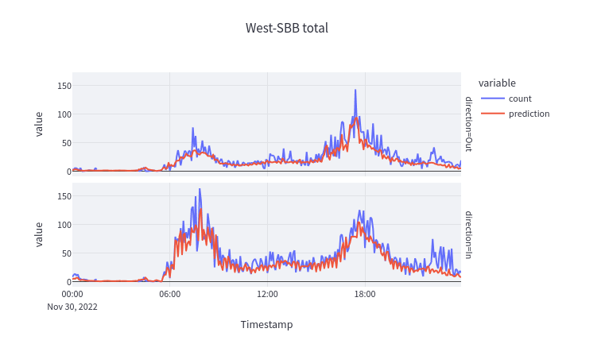

# Predict Hardbrücke

Predicting passenger frequencies at Hardbrücke station in Zurich. Streamlit App that uses Machine Learning trained on Open Data from: https://data.stadt-zuerich.ch/dataset/vbz_frequenzen_hardbruecke

Die Anzahl der Fahrgäste an einer Haltestelle unterliegt bestimmten Regelmässigkeiten, auch in Zeiten einer Pandemie. Die VBZ stellen die Fahrgastfrequenzen der Haltestelle Hardbrücke in Zürich offen zur Verfügung. Wie viele Personen die Haltestelle, aus welcher Richtung betreten oder verlassen haben, lässt sich so detailliert nachvollziehen. Mit Machine Learning können regelmässige Muster in den Daten erkannt und damit auch Prognosen für die Zukunft erstellt werden. Sehen Sie hier die Prognosen eines Modells, das mit den Daten der Vorjahre trainiert wurde. Sofern die tatsächlichen Frequenzen zur Verfügung stehen, können sie direkt mit den Prognosen verglichen werden.

